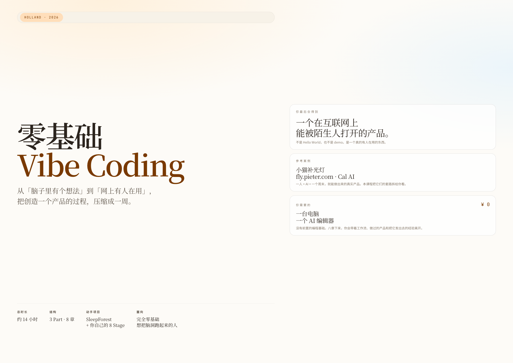

<div align="center">

# 零基础 Vibe Coding

### 从「脑子里有个想法」到「网上有人在用」，把创造一个产品的过程，压缩成一周。

<br/>



<br/>

**一门面向完全不会写代码的人的 AI 编程课。**

8 章 · 约 14 小时 · 真实项目驱动 · 零基础到上线

[📘 下载完整 PDF（横向排版）](./零基础%20Vibe%20Coding.pdf) · [🌐 在线阅读](https://github.com/heloraai/holland-vibe-coding-course) · Holland · 2026

</div>

---

## 为什么你会想看这门课

你有没有过这种时刻：

> 「我要是会编程，这事儿我自己就能做了。」

可能是一个小工具，一个 App 的雏形，一个自己想了很久的网站，一个你想帮朋友解决的问题。脑子里很清楚，但一到要动手，就卡在「我不会代码」这里。

**这门课就是为这种时刻准备的。**

过去两年，AI 改变了「写代码」这件事。像 [小猫补光灯](https://apps.apple.com/cn/app/%E5%B0%8F%E7%8C%AB%E8%A1%A5%E5%85%89%E7%81%AF/id6504879533)（一个人用 Cursor + 一个周末做出来的 iOS 应用）、[fly.pieter.com](https://fly.pieter.com/)（Pieter Levels 3 小时做出来、10 天内收入破十万美金的 3D 小游戏）、Cal AI（两个高中生做出来的、下载破五百万的拍照查卡路里 App）这类案例已经不是新闻。它们有一个共同点：**作者本人不是传统意义上的工程师**。他们是有想法的人，借助 AI，把想法跑了出来。

这种新的做东西的方式，英文圈叫它 **Vibe Coding**。

这门课，就是带你走完这条路一次。

<br/>

## 这门课适合谁

在心里对着下面的列表勾一勾：

- [ ] 完全不会写代码，甚至不太知道「一个网站」是怎么搭起来的
- [ ] 会一点 Excel、Notion、Figma，但从没碰过「真正的代码」
- [ ] 脑子里一直有一个「我要是会编程就好了」的想法
- [ ] 看别人做独立产品很羡慕，但不知道自己该从哪儿开始
- [ ] 想体验一次「从 0 到 1，做出一个真的能被别人用的东西」的感觉

**只要有一项中了，这门课就写给你的。**

反过来，如果你已经是一个有经验的工程师，这门课不会教你新的技术栈。它更像一份给朋友的指南，告诉他们：AI 时代做东西的逻辑已经变了。

<br/>

## 你最后会得到什么

不是一份「学完了」的证书，而是三样真实的东西：

1. **一个跑在互联网上的、有链接的产品。** 不是 Hello World，也不是一个只在本地跑的 demo。是一个你发给任何陌生人，他们都能打开来用的东西。
2. **一套可以复用的工作流。** 一个想法是怎么变成产品的？每一步都卡在哪里？怎么用 AI 配合自己？你会有自己的答案。
3. **一个可以继续生长的基础。** 课程结束不是终点。第 8 章会给你一张 3 个月的路线图，告诉你下一步该往哪儿走。

<br/>

## 课程骨架：3 个 Part，8 章

整门课是三段式结构。**前两章只动脑，中间四章跟着一个项目走完整条链路，最后两章你自己做一遍。**

### Part 1 · 心法与准备 · ~2h

先把「Vibe Coding 到底是什么」和「你要做什么」想清楚。这两章不写代码，只动脑。

| # | 章节 | 目标 | 时长 |
|---|------|------|------|
| **Ch 1** | Vibe Coding 是什么 | 听完之后你会有一种「这事儿我能干」的感觉 | 45 分钟 |
| **Ch 2** | 找到你的 Concept | 离开时，你会有一个用一句话讲得清楚的项目想法 | 1 小时 |

### Part 2 · 跟着 SleepForest 走一遍 · ~6h

我们会一起拆解一个叫 **SleepForest** 的完整小项目，从原型到上线。你不用自己想，跟着做就行。

| # | 章节 | 目标 | 时长 |
|---|------|------|------|
| **Ch 3** | 用 Google AI Studio 做原型 | 在浏览器里做出一个能点、能交互的原型。不写一行代码 | 90 分钟 |
| **Ch 4** | 认识 Codex | 第一次让 Codex 改动一个真实项目 | 90 分钟 |
| **Ch 5** | 从原型到完整产品 | 看懂一个前端项目怎么组成、怎么把原型长大成产品 | 3 小时 |
| **Ch 6** | 什么是 Vercel？部署上线 | 让项目从「只在我电脑上能跑」变成「全世界都能打开的一个链接」 | 90 分钟 |

### Part 3 · 自己做一遍 · ~6h

前面看懂了别人的项目，这一部分你自己从零做一个。这是整门课最有分量的一段。

| # | 章节 | 目标 | 时长 |
|---|------|------|------|
| **Ch 7** | 动手实战 · 8 Stage 模型 | 一个上线的、能分享的、你自己从零做的小项目 | 4–6 小时 |
| **Ch 8** | 继续 Vibe 下去 | 结课之后接下来 3 个月该往哪儿走 | 1 小时 |

<br/>

## 课程里会出现的真实案例

这门课不靠「假设你有一个想法」来推进。我们会反复回到下面这几个已经发生过的真实项目，拆解它们的套路：

| 项目 | 谁做的 | 多久 | 为什么值得拆 |
|------|-------|------|-------------|
| 🐱 **小猫补光灯** | 一个人 + Cursor | 一个周末 | iOS App Store 爆款，靠一个极简到极致的需求点火 |
| ✈️ **[fly.pieter.com](https://fly.pieter.com/)** | Pieter Levels + Cursor | 3 小时 | 浏览器里的 3D 飞行游戏，10 天 MRR 破 $100K |
| 🍎 **Cal AI** | 两个高中生 | 一个暑假 | 拍一张食物照片就能测卡路里，下载破 500 万 |

你会看到它们共同的做法：**不追求完整，追求「能发出去」**；**先解决一个极小、极具体的问题**；**用 AI 把工程量压成一个人能承担的规模**。

<br/>

## 这门课跟其他「AI 编程课」有什么不一样

大部分 AI 编程课教你「怎么让 AI 帮你写代码」。这门课想教的是另一件事：

> **「在 AI 能写代码的时代，一个完全不会代码的人，怎么把自己的想法变成一个别人能用的产品。」**

这是两件事。前者是技术，后者是一整条「做东西」的链路——想法、原型、迭代、调试、部署、分享。这门课刻意走完整条，不在任何一步上省略。

几个具体的区别：

- **不教语法，教品味。** Vibe Coding 时代，让你和别人拉开差距的不是「记住 JavaScript 语法」，是「知道什么样的东西好」。
- **不讲半截。** 很多课做到「在本地跑起来」就结束了。这门课一定会把你送到「有一个真实的链接能分享出去」这一步。
- **不脱离真实案例。** 每一章的工具和技巧都挂在一个真实跑通过的产品上。

<br/>

## 怎么开始

### 方式一：在线看（推荐）

整门课是一个可以直接在浏览器里打开的网站。

```bash
# 把代码拉下来
git clone https://github.com/heloraai/holland-vibe-coding-course.git
cd holland-vibe-coding-course

# 启动一个小服务器（任选一个）
python3 -m http.server 8000
# 或者
npx serve .

# 浏览器打开 http://localhost:8000
```

不想跑服务器的话，直接双击 `index.html` 也能看。

### 方式二：下载 PDF（适合离线 / 通勤阅读）

👉 [**零基础 Vibe Coding.pdf**](./零基础%20Vibe%20Coding.pdf)（横向 A4，约 15MB）

PDF 是从课程网站直接导出的，保留了完整的排版和章节结构。适合放在 iPad 上读，或者打印下来做笔记。

<br/>

## 你需要准备的

- **一台电脑**（Mac / Windows 都行）
- **一个 AI 编辑器**（课里会推荐，现在用 Cursor / Codex / Claude Code 都可以）
- **一个想法**（不用完整，模糊的也没关系，我们会在 Ch 2 一起把它捋清楚）
- **一周左右的时间**（每天挤 1–2 小时，能走完）

> **⚠️ 特别说明：你不需要任何编程基础。** 真的不需要。如果你已经会一点，那更好，但不是前置条件。

<br/>

## 课程作者

**Holland**，在做 AI 产品和内容的独立创造者。

这门课是我自己「从零学 Vibe Coding」的路径的整理版。如果你在学的过程中有任何问题、或者你跟着课做了自己的项目，欢迎来聊聊。

<br/>

## 仓库里都有什么

```
.
├── index.html              # 课程主页（3 Part · 8 章地图）
├── chapter.html            # 通用章节阅读器（Ch 1–4, 6–8）
├── chapter-5.html          # Ch 5 独立版本（内容更厚）
├── print-cover.html        # PDF 封面 + 目录页
├── assets/
│   ├── styles.css          # 全局样式 + 打印样式
│   ├── course-data.js      # 章节元数据（单一数据源）
│   ├── chapter-bodies.jsx  # Ch 1–4, 6–8 的正文
│   └── pages/
│       ├── ChapterContent.jsx  # 通用章节组件
│       └── ChapterReader.jsx   # Ch 5 专用组件
├── 零基础 Vibe Coding.pdf   # 课程的 PDF 版本（横向 A4）
└── cover-preview.png       # 封面预览图
```

<br/>

## 协议

这门课免费、开源、可以自由传播。如果它帮到了你，做出一个自己的小东西之后来告诉我一声——对我就是最好的回报了。

<div align="center">

---

**从这一秒开始，你就不再是「不会编程的人」了。**

[👉 开始 Ch 1 · Vibe Coding 是什么](chapter.html?ch=1)

</div>
